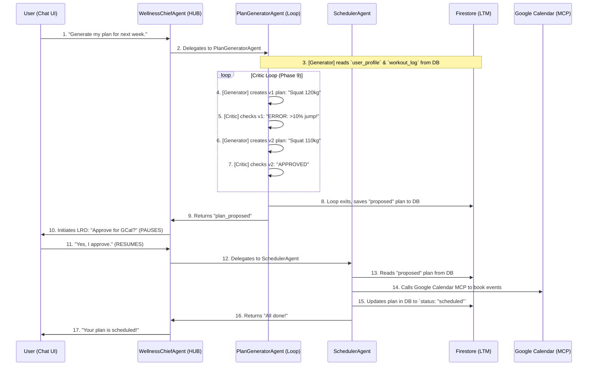

# Project Plan: Personal Wellness Coach

This document outlines a granular and incremental plan for building the "Personal Wellness Coach." Each phase results in a new, working, and demo-able feature set, building from a simple chatbot to a fully adaptive coach.

This plan is designed to adhere to the best practices and checklist files provided for the course.

---

## 1. Core Architectural Decisions

This plan is based on the following key decisions:

### MVA First
The first "Minimum Viable Agent" (MVA) will be a chat-only planner. It will be a working agent from the very first phase, with no external dependencies.

### Incremental Complexity
We will add features in logical, self-contained blocks. Each phase builds on the last, adding one new major capability.

### Observability & Evaluation

- **Observability**: We will use `adk web --log_level DEBUG` from Phase 1 onward.
- **Evaluation**: We will create and add to our `evalset.json` at the end of each phase to prevent regressions.

### Session Management
We will start with `InMemorySessionService` for Phases 1-3 and explicitly migrate to `DatabaseSessionService` in Phase 4 as a prerequisite for the Long-Running Operation (LRO).

**Note on Session State (Task 3 Deferral)**:
- **Phase 1 Implementation Decision** (2025-11-17): Explicit session state management (using `tool_context.state`) has been deferred to Phase 3 or 4
- **Rationale**: Gemini 2.5 Flash has 1M token context window, sufficient for Phase 1 conversation context without explicit state management
- **Clarification**: Session state serves a **different purpose** from permanent memory:
  - **Session State** = temporary conversation context within single session (user preferences before saving)
  - **Permanent Memory** = historical data across sessions stored in Firestore (user profile, past plans, progress)
- **Future Implementation**: Will add explicit session state when implementing Firestore integration (Phase 3+), where it will track temporary conversation flow state and user preferences before permanent storage
- **Complementary Features**: Session state and Memory Bank are not alternatives - they work together for different purposes

### Database & Multiple Goals

- **Decision**: We will design the Firestore schema from Day 1 to support multiple goals, even if we only implement the logic for a single goal in the MVP.
- **Schema**: All major collections (`plan`, `workout_log`) will have a `goal_id` field. The `user_profile` will have an `active_goal_id` field. This makes multi-goal support a "Future Work" feature rather than a massive refactor.

---

## 2. The Incremental Plan

### Phase 1: The "Chat-Planner" (The MVA)

**Goal**: A working, conversational agent that asks the user for their goals and generates a text-based workout plan.

**Demo**: User says, "Plan my 5k." The agent asks clarifying questions (e.g., "How many days a week can you train?") and then prints a structured, multi-week plan directly in the chat.

**Key Concepts**: Agent Design, LLM-based Orchestration, Session State (for preferences), `InMemorySessionService`.

**Actions**:

1. **Agent**: Create the `WellnessChiefAgent`.
   - **Instruction**: Give it a detailed instruction prompt to:
     - a. Act as an expert wellness coach.
     - b. Ask for key preferences (goal, days per week, experience level).
     - c. Generate a general, text-based plan based on those preferences.

2. **Session**: Use `InMemorySessionService`. We can use Session State (`tool_context.state`) to store the user's preferences during this single conversation.

3. **Evaluate**: Create `evalset_phase1.json` to test that the agent asks the right questions and generates a reasonable plan.

### Phase 2: The "Instructor" (Adding a Spoke)

**Goal**: Add the "Instructor" feature. The agent can now explain how to do the exercises in the plan.

**Demo**: User asks, "How do I do a proper squat?" The agent provides a step-by-step text explanation and uses a tool to find a relevant YouTube video link.

**Key Concepts**: Agent Specialization, Agent Tools, Built-in Tools (Google Search).

**Actions**:

1. **New Agent**: Create the `InstructorAgent`.
   - **Tool**: Give it the Google Search Built-in Tool.
   - **Instruction**: Instruct it to "find 1-2 high-quality, instructional YouTube video links for the given exercise" and "provide a brief, safe, step-by-step guide."

2. **Orchestration**: Upgrade the `WellnessChiefAgent` (the Hub) to use the `InstructorAgent` as an Agent Tool when the user asks for exercise explanations.

3. **Evaluate**: Add to your evalset to test this new "how-to" skill.

---

### Phase 3: The "Plan Persister" (First Memory)

**Goal**: Save the agent's generated plan to our Long-Term Memory (Firestore). This is a crucial step for all future phases.

**Demo**: After the plan is generated (from Phase 1), the agent asks, "Should I save this plan to your profile?" The user says "yes," and the plan (as JSON) is saved to Firestore.

**Key Concepts**: Long-Term Memory (Firestore), Function Tools (Custom).

**Actions**:

1. **Firebase Setup**: Create the new Firebase project with schemas for `user_profile` (to hold `active_goal_id`) and `plan` (with `goal_id`, `week`, `day`, `exercises`, `status: "proposed"`).

2. **New Tools (Custom)**:
   - `save_plan_to_firestore(plan_json, goal_id)` - Writes the plan to the `plan` collection.
   - `set_active_goal(goal_id)` - Updates the `user_profile` doc.

3. **Orchestration**: Upgrade the `WellnessChiefAgent` to use these tools after the user confirms they like the generated plan.

4. **Evaluate**: Add tests for saving and retrieving a plan.

---

### Phase 4: The "Scheduler" (LRO & Calendar)

**Goal**: Add the Google Calendar integration, protected by the "must-have" User Approval Workflow.

**Demo**: Agent asks, "I have saved your 12-week plan. Do you also approve me adding this to your Google Calendar?" The user says "yes," and their Google Calendar is populated.

**Key Concepts**: Long-Running Operations, Session Service Migration, MCP Tools (Google Calendar).

**Actions**:

1. **CRITICAL (Session)**: Migrate the Runner from `InMemorySessionService` to `DatabaseSessionService(db_url="sqlite:///sessions.db")`. This is mandatory for the LRO to work.

2. **New Agent**: Create the `SchedulerAgent` (Spoke).
   - **Tool (MCP)**: Connect the `SchedulerAgent` to the Google Calendar MCP server.

3. **Implement LRO (Approval)**:
   - Upgrade the `WellnessChiefAgent`'s logic. After saving the plan (Phase 3), it will immediately call `tool_context.request_confirmation(...)` to ask for calendar approval. This pauses the agent.

4. **Connect Workflow**:
   - When the user's "yes" response resumes the agent:
     - The `WellnessChiefAgent` calls the `SchedulerAgent` (as an Agent Tool).
     - The `SchedulerAgent` reads the plan from Firestore (Tool: `get_plan(goal_id)`) and books the events in the calendar, updating the plan docs to `status: "scheduled"`.

5. **Evaluate**: Add tests for the approval flow (both "yes" and "no" paths).

---

### Phase 5: The "Logger" (Detailed & Adherence Tracking)

**Goal**: Implement both of the "logging" requirements:
1. Detailed performance logging
2. Plan adherence

**Demo**:

- User: "Log my squats: 3 sets of 8 at 100kg." → Agent confirms, "Logged." (Shows a new doc in `workout_log`).
- User: "I finished my workout for today." → Agent finds the plan doc for today and updates it: `status: "completed"`.

**Key Concepts**: Function Tools (Custom), Agent Specialization.

**Actions**:

1. **Firebase Setup**: Create the detailed `workout_log` collection (for raw performance data).

2. **New Agent**: Create the `TrackerAgent` (Spoke).

3. **New Tools (Custom)**:
   - `log_detailed_workout(activity_type, data)`: Writes a new doc to `workout_log` (e.g., `{type: "strength", results: {exercise: "squat", sets: [...]}}`).
   - `mark_plan_complete(plan_doc_id, status)`: Updates an existing doc in the `plan` collection.

4. **Orchestration**: Upgrade the `WellnessChiefAgent`'s NLU to understand the difference between a detailed log ("I did...") and an adherence check-in ("I'm done").

5. **Evaluate**: Add test cases for both logging types.

---

### Phase 6: The "Editor" (Plan Modification)

**Goal**: Allow the user to manually edit their future plan.

**Demo**: User: "My plan for next Friday says 105kg squat, that's too much. Can you change it to 100kg?" Agent confirms, "Done. I've updated your plan." (You can show the plan doc in Firestore updating).

**Key Concepts**: Function Tools (Custom).

**Actions**:

1. **New Tool (Custom)**: Add `edit_planned_workout(plan_doc_id, exercise_name, new_target)` to the `TrackerAgent`.

2. **Orchestration**: Upgrade the `WellnessChiefAgent` to understand "edit" requests and delegate them.

3. **Evaluate**: Add test cases for editing future plans.

---

### Phase 7: The "Nutritionist" (Core Feature)

**Goal**: Integrate nutrition logging and analysis as a core part of the agent.

**Demo**:

- User: "Log my breakfast: 2 eggs." (Agent calls Nutritionix, gets macros, logs to `nutrition_log`).
- User: "How was my nutrition this week?" (Agent uses Code Exec to run Python, aggregate logs, and give a summary).

**Key Concepts**: OpenAPI Tools (Nutritionix), Code Execution, Function Tools (Custom).

**Actions**:

1. **Firebase Setup**: Create the `nutrition_log` collection.

2. **New Agent**: Create the `NutritionistAgent` (Spoke).

3. **New Tools**:
   - **Tool (OpenAPI)**: Nutritionix (to get data).
   - **Tool (Custom)**: `log_meal(...)` (writes to `nutrition_log`).
   - **Tool (Custom)**: `get_nutrition_log(range)`.
   - **Tool (Code Exec)**: Add the `BuiltInCodeExecutor` to the `NutritionistAgent` for data aggregation.

4. **Evaluate**: Add "nutrition logging" and "nutrition summary" test cases to your evalset.

---

### Phase 8: The "Adaptive Coach" (First Loop)

**Goal**: Connect feedback to the plan. This is the first "Plan-Do-Check-Act" loop.

**Demo**:

- User: "Log my 5km run, it was way too hard." (Agent logs run and also updates `user_profile` with a negative modifier. This is Memory Consolidation).
- User: "Generate my plan for next week." (The `PlanGeneratorAgent` now reads the logs and the modifier, proposing an easier plan).

**Key Concepts**: Memory Consolidation, ParallelAgent.

**Actions**:

1. **New Tool (Custom)**: `update_progression_modifier(field, new_value)`.

2. **New Agent**: Create the `PlanGeneratorAgent` (Spoke). Its instruction is to read logs (`get_workout_log`) and modifiers (`get_user_profile`) to generate an adapted plan, then save it (`save_plan_to_firestore`).

3. **Upgrade WellnessChiefAgent**:
   - When user gives feedback ("too hard"), it calls `update_progression_modifier` (this is the Memory Consolidation step).
   - When user asks for a "weekly summary," it uses a `ParallelAgent` to call both the `TrackerAgent` and `NutritionistAgent` to get their summaries concurrently.

4. **Evaluate**: Add the "adaptive" test cases to your evalset.

---

### Phase 9: The "Refiner" (The Critic Loop)

**Goal**: Upgrade the `PlanGeneratorAgent` to be a "safety-critic" loop.

**Demo**: (This is a "behind-the-scenes" demo for your video). Show the logs: The `PlanGeneratorAgent` proposes a 20% jump in weight. The `CriticAgent` catches it, sends feedback, and the `PlanGeneratorAgent` revises it to a 10% jump before ever showing it to the user.

**Key Concepts**: LoopAgent, Iterative Refinement.

**Actions**:

1. **New Agent**: Create a `CriticAgent` (internal).
   - **Instruction**: Give it a clear instruction: "You are a safety critic. Compare the proposed plan to the user's log. If the progression is >10%, respond with a warning. Otherwise, respond with 'APPROVED'."

2. **Re-architect**: Re-build the `PlanGeneratorAgent` as a `LoopAgent` that contains:
   - a. The original `PlanGeneratorAgent` (as the "refiner").
   - b. The new `CriticAgent`.

3. **Evaluate**: Add a test case to ensure the critic loop catches unsafe plans.

---

### Phase 10: The "A2A Service" (The Capstone)

**Goal**: Expose the finished, holistic agent as a discoverable service for other AI agents to use.

**Demo**: Show the agent's `/.well-known/agent-card.json` in a browser.

**Key Concepts**: A2A Protocol.

**Actions**:

1. **Refactor**: Ensure the `WellnessChiefAgent`'s logic can be called "headless."

2. **Expose**: Use the ADK's `to_a2a()` utility to wrap your root agent and serve it as an HTTP endpoint.

3. **Document**: Create the `agent-card.json` that formally describes its skills (e.g., `generate_plan`, `log_workout`).

---

### Phase 11: Extensions & Polish

**Goal**: Add the final "bells and whistles" that build on the robust chassis.

**Demo**: Show the agent auto-syncing with Strava.

**Key Concepts**: MCP Tools (Strava), Production Deployment.

**Actions**:

1. **TrackerAgent (Upgrade)**:
   - **Tool (MCP)**: Add the Strava MCP server.
   - **Tool (Custom)**: Add a `sync_strava()` tool that fetches new runs and calls the existing `log_detailed_workout` tool from Phase 5.

2. **Deployment Prep**: Finalize `requirements.txt`, `.agent_engine_config.json`, and prepare for `adk deploy agent_engine` as per the "Production Deployment" checklist.

---

## 3. Final Project Architecture

This plan results in a "Hub-and-Spoke" architecture with a centralized, structured Long-Term Memory (Firestore). The `WellnessChiefAgent` acts as an LLM-Based Orchestrator, and the specialist agents act as its Agent Tools.

### Component Diagram (Final State)

```mermaid
graph TD
    USER[USER (via Chat UI)] --> HUB(WellnessChiefAgent - HUB);
    HUB -- LROs --> SESS_DB[(Session DB)];
    A2A[A2A Protocol API] <--> HUB;

    subgraph "Specialist Agents (Spokes)"
        HUB -- "how to..." --> INSTRUCTOR[InstructorAgent <br/> - Tool: Google Search];
        HUB -- "gen plan" --> PLAN_LOOP(PlanGeneratorAgent - Loop);
        HUB -- "schedule" --> SCHEDULER[SchedulerAgent <br/> - Tool: GoogleCal (MCP)];
        HUB -- "log/edit" --> TRACKER[TrackerAgent <br/> - Tool: Strava (MCP)];
        HUB -- "nutrition" --> NUTRITIONIST[NutritionistAgent <br/> - Tool: Nutritionix (API) <br/> - Tool: Code Exec];
    end

    subgraph "Plan Generation Loop (Phase 9)"
        PLAN_LOOP --> GEN[Generator (Refiner)];
        GEN --> CRITIC[Critic (Safety Check)];
        CRITIC -- "feedback" --> GEN;
        CRITIC -- "APPROVED" --> PLAN_LOOP;
    end

    subgraph "Long-Term Memory (Firestore DB)"
        direction TB
        DB_USERS[users]
        DB_GOALS[goals]
        DB_PLAN[plan]
        DB_LOG[workout_log]
        DB_NUTR[nutrition_log]
    end

    PLAN_LOOP -- "R/W" --> DB_USERS;
    PLAN_LOOP -- "R" --> DB_LOG;
    PLAN_LOOP -- "W" --> DB_PLAN;

    SCHEDULER -- "R/W" --> DB_PLAN;
    TRACKER -- "R/W" --> DB_LOG;
    TRACKER -- "R/W" --> DB_PLAN;
    NUTRITIONIST -- "R/W" --> DB_NUTR;
```

---

### Workflow Diagram (Adaptive Plan Generation)

This diagram shows the full workflow for the core "Adaptive Coach" loop, including the Critic Loop and LRO.



---


## 4. Database Schema (Long-Term Memory)

This is the proposed Firestore schema, designed to support all features including multiple and sub-goals.

### 1. `users` Collection

**doc_id**: `{userId}`

- **`active_goal_id`** (string): `"goal_5k_nov2025"` - Tells the agent which goal to work on by default.
- **`preferences`** (map): `{prefers_mornings: true, days_per_week: 4}`
- **`progression_modifiers`** (map): `{squat_kg: 1.01, run_pace: 0.98}` - The core of the adaptive coach (Phase 8). Stores "difficulty" feedback.

---

### 2. `goals` Collection

**doc_id**: `{goalId}` (e.g., `"goal_5k_nov2025"`)

- **`user_id`** (string): `"{userId}"` - For security rules.
- **`parent_goal_id`** (string): `null` or `"goal_strength_main"` - This supports the sub-goal idea.
- **`type`** (string): `"cardio"` | `"strength"` | `"sub-goal"`
- **`target_metric`** (string): `"distance_km"` | `"weight_kg"` | `"reps"`
- **`target_value`** (number): `5` | `100` | `50`
- **`target_date`** (string): `"2026-03-01"`
- **`is_active`** (boolean): `true` - Allows the user to have multiple goals, but only one is "active".

---

### 3. `plan` Collection

**doc_id**: `{planId}`

- **`user_id`** (string): `"{userId}"`
- **`goal_id`** (string): `"{goalId}"`
- **`date`** (string): `"2025-11-20"`
- **`status`** (string): `"proposed"` | `"scheduled"` | `"completed"` | `"skipped"` - This is for adherence logging (Phase 5).
- **`exercises`** (array):
  - `[{name: "Run", type: "cardio", target: {distance_km: 5, time_min: 27}}]`
  - `[{name: "Squat", type: "strength", target: {sets: 3, reps: 8, weight_kg: 102.5}}]`

---

### 4. `workout_log` Collection (Detailed Performance)

**doc_id**: `{logId}`

- **`user_id`** (string): `"{userId}"`
- **`goal_id`** (string): `"{goalId}"`
- **`plan_id`** (string, optional): `"{planId}"` - Links this log back to the planned workout.
- **`date`** (timestamp): (Server timestamp)
- **`name`** (string): `"Squat"` or `"Morning Run"`
- **`type`** (string): `"cardio"` | `"strength"`
- **`results`** (map or array):
  - If strength: `[{reps: 8, weight_kg: 100}, {reps: 8, weight_kg: 100}]` (array)
  - If cardio: `{distance_km: 5, time_min: 26.5, avg_pace: "5:18/km"}` (map)
- **`feedback`** (string, optional): `"easy"` | `"hard"` | `"felt_good"` - Another way to feed the adaptive loop.

---

### 5. `nutrition_log` Collection

**doc_id**: `{logId}`

- **`user_id`** (string): `"{userId}"`
- **`goal_id`** (string, optional): `"{goalId}"` - Optional link to the active goal for future-proofing.
- **`date`** (timestamp): (Server timestamp)
- **`meal_type`** (string): `"breakfast"`
- **`items_raw`** (array): `["2 eggs", "1 coffee"]`
- **`macros_total`** (map): `{calories: 150, protein_g: 12, fat_g: 10, carb_g: 1}`

---

## 5. Repository Structure

**Current Structure (Phase 1)**:
```
momentum/
├── agents/
│   ├── agent.py           # Root agent export (required by ADK, exports root_agent)
│   ├── hub.py             # WellnessChiefAgent (Phase 1+)
│   ├── __init__.py        # Package exports
│   ├── prompts/           # Agent instruction prompts (Python constants)
│   │   ├── __init__.py
│   │   └── wellness_chief.py
│   └── .env → ../.env.local  # Symlink (ADK auto-loads this)
├── docs/
│   ├── roadmap.md         # This file - full project plan
│   ├── PROGRESS.md        # Phase completion tracking
│   ├── phases/            # Detailed phase implementation plans
│   └── best-practices/    # ADK guidelines and checklists
├── evals/
│   └── evalset_phase*.json  # Evaluation sets (one per phase)
├── .env.local             # API keys (gitignored, single source of truth)
├── .env.example           # Template for environment setup
├── .gitignore
├── README.md
└── requirements.txt
```

**Final Structure (All Phases)**:
```
momentum/
├── agents/
│   ├── agent.py              # Root agent export (exports root_agent)
│   ├── hub.py                # WellnessChiefAgent (main orchestrator)
│   ├── __init__.py
│   ├── prompts/              # All agent instruction prompts (centralized)
│   │   ├── __init__.py
│   │   ├── wellness_chief.py
│   │   ├── instructor.py     # Phase 2
│   │   ├── scheduler.py      # Phase 4
│   │   └── ...
│   ├── .env → ../.env.local
│   └── spokes/               # Specialist agents
│       ├── instructor_agent.py    # Phase 2
│       ├── scheduler_agent.py     # Phase 4
│       ├── tracker_agent.py       # Phases 5, 6, 11
│       ├── nutritionist_agent.py  # Phase 7
│       └── planner/
│           ├── generator_agent.py # Phase 8
│           └── critic_agent.py    # Phase 9
├── tools/
│   ├── firestore_tools.py    # Custom function tools (Phases 3+)
│   └── external_api_tools.py # API wrappers (Phase 7+)
├── core/
│   ├── database.py           # Firestore client (Phase 3+)
│   └── sessions.py           # DatabaseSessionService (Phase 4+)
├── docs/
├── evals/
└── .env.local
```

**Key Points**:
- `agents/agent.py` - Required by ADK web command, must export `root_agent` variable
- `agents/.env` - Symlink to `.env.local` (ADK auto-discovers and loads env vars from agent dir)
- `agents/prompts/` - Centralized package for all agent instruction prompts (Python constants)
- Prompts are Python modules with `PROMPT` constants, imported directly (no file I/O)
- Phase-specific agents added to `agents/spokes/` as we progress

---
